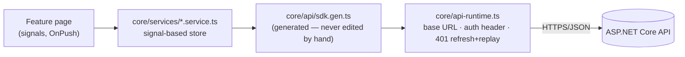

# SIRIEDUMARKET — Frontend 🌸


-1890FF)


Angular frontend for **SIRIEDUMARKET**, an online marketplace for academic documents, study
summaries and templates — a Thai-market take on [Teachers Pay
Teachers](https://www.teacherspayteachers.com/), styled around a minimal light-pink design
system and priced for local checkout (Stripe: card / PromptPay / wallet).

Every screen is wired to the real [.NET backend](https://github.com/jatupolman3CS/siri_edu_market_backend)
— there is no mock data path left. API calls go exclusively through a TypeScript SDK generated
from the backend's OpenAPI document, and a CI-enforced drift check keeps the two in sync
(**190 backend endpoints ↔ 189 SDK functions, 0 orphaned on either side**).

---

## Tech Stack

| Layer | Technology | Version |
| --- | --- | --- |
| Framework | Angular — standalone components, Signals, zoneless change detection | `21.2.x` |
| UI library | NG-ZORRO (Ant Design for Angular) | `21.2.x` |
| Styling | Tailwind CSS + a custom pink-tinted theme | `3.4.x` |
| State | Angular Signals (no NgRx/Redux) | built-in |
| Routing | Angular Router, fully lazy-loaded, with guards | built-in |
| API layer | `@hey-api/openapi-ts`-generated SDK over `@hey-api/client-fetch` | — |
| Testing | Vitest (unit) + Playwright (e2e) | `4.x` / `1.62.x` |

## Architecture



`features/**` never imports the generated SDK directly — every call is routed through
`core/services/`, and a lint-time guard (`npm run audit:guard`) fails the build if that rule is
broken. Regenerating the SDK (`npm run generate:api`) after a backend contract change is the
only way generated files are ever touched.

## Key Features

- **Marketplace & discovery** — home feed (trending, bundles, free resources, editor's picks),
  filterable marketplace search, category drill-down, seller storefronts.
- **Document experience** — detail pages with Q&A and reviews, related bundles, wishlist,
  purchase library.
- **Checkout & subscriptions** — cart → Stripe Payment Element checkout (card / PromptPay /
  wallet), order history, monthly subscription membership management.
- **Seller studio** — 4-step upload flow, AI-assisted listing autofill, dashboard, earnings,
  reviews, Q&A, storefront section builder.
- **Admin console** — approval queue, transactions, sellers, categories, subscriptions, exam
  hub content, audit log.
- **Auth** — email/password with a strength meter, Google/Facebook/LINE social login, 6-digit
  email OTP verification, forgot/reset password — backed by real JWT + refresh tokens (401s
  transparently refresh and replay the original request).

## Folder Structure

```
src/app/
├── core/                          # Singletons & app-wide concerns
│   ├── models/                    # TypeScript interfaces & enums
│   ├── api/                       # Generated OpenAPI SDK (never hand-edited)
│   ├── api-mappers/                # DTO → domain-model mapping
│   ├── services/                  # Signal-based stores, the only callers of core/api
│   └── guards/                    # Route guards (authGuard, guestGuard, …)
├── shared/                        # Reusable across features
│   ├── components/                # Logo, Icon, DocumentCard, BundleCard, …
│   └── pipes/                     # thb, compact, timeAgo
├── layouts/                       # Page shells
│   ├── buyer/ · seller/ · admin/ · auth/
└── features/                      # Route components (58 feature areas), each lazy-loaded
    ├── buyer/                     # Home, Marketplace, Document, Cart, Library, …
    ├── seller/                    # Dashboard, Upload, AI Assistant, Earnings, …
    ├── admin/                     # Approval, Transactions, Sellers, Subscriptions, …
    └── auth/                      # Login, Register, Verify Email, Forgot Password
```

## Getting Started

Requires **Node.js ≥ 20** and **npm ≥ 10**.

```bash
npm install
npm start          # http://localhost:4200
```

The UI talks to a real backend — there is no mock mode — so `npm start` on its own renders an
empty app. Run the [backend](https://github.com/jatupolman3CS/siri_edu_market_backend) alongside
it:

```bash
# terminal 1 — API on http://localhost:5282
cd ../siri_edu_market_backend
dotnet run --project src/SIRIEDUMARKET.Api/SIRIEDUMARKET.Api.csproj

# terminal 2 — UI on http://localhost:4200
npm start
```

`dotnet run` refuses to boot without its required secrets. Copy `.env.example` to `.env` at the
monorepo root and fill in at minimum `ConnectionStrings__DefaultConnection`, `Jwt__Key`, and the
`R2__*` values — see the backend's
[`CONFIGURATION.md`](../siri_edu_market_backend/src/SIRIEDUMARKET.Api/CONFIGURATION.md) for the
full list. The API target is configured once, in
[`src/environments/environment.development.ts`](src/environments/environment.development.ts).

### Verification

```bash
npm run build
npm run audit:guard        # forbids features/** from importing the SDK directly
npm run audit:coverage     # backend-endpoint ↔ SDK-function drift report
npx ng test --watch=false
```

## Design System

- Signature radius: `2.5rem` (`rounded-3xl`)
- Palette: a 9-shade pink scale (`pink-50` → `pink-900`) plus ink/cream/canvas neutrals
- Typeface: Plus Jakarta Sans + Noto Sans Thai
- Custom shadow tokens (`shadow-soft`, `shadow-pop`, `shadow-float`) and Tailwind keyframe
  animations (`fade-in`, `slide-up`, `pulse-soft`)

Defined in `tailwind.config.js` and CSS variables in `src/styles.scss`.

## More Docs

- [`AGENTS.md`](AGENTS.md) — 60-second briefing for AI agents / new contributors
- [`INSTRUCTION.md`](INSTRUCTION.md) — how-to guide (adding a feature, page, service)
- [`SKILL.md`](SKILL.md) — code conventions & patterns
- [`ARCHITECTURE.md`](ARCHITECTURE.md) — technical deep-dive
- [`coverage.md`](coverage.md) — generated endpoint-coverage report

## License

Private / portfolio project — not licensed for reuse.
